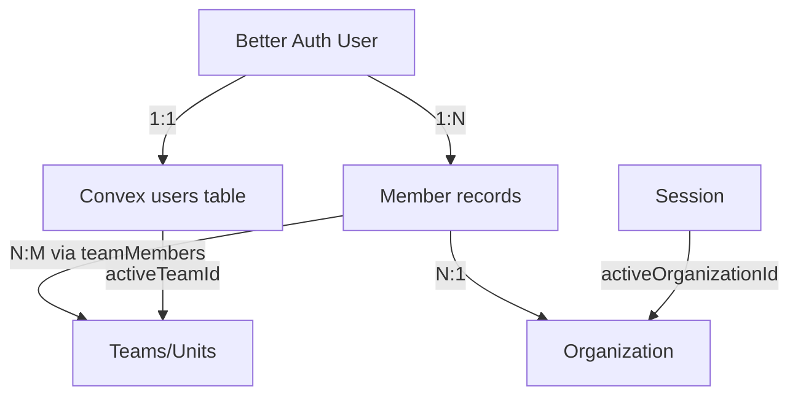

# Care Homes Management System - User Management & RBAC Analysis

## Executive Summary

This document provides a comprehensive analysis of the current onboarding, user management, and access control implementation in the care homes management system. The analysis identifies gaps between current implementation and target RBAC requirements for Owner, Manager, Nurse, and Care Assistant roles.

---

## 1. Current Onboarding Flow

### Architecture
The system uses **Better Auth** (via `@convex-dev/better-auth`) as the primary authentication provider, integrated with **Convex** as the backend database.

### User Registration Process

#### Self-Registration Flow (Owner)
1. **Signup** (`/signup`)
   - User provides: name, email, password
   - Better Auth creates authentication record
   - Convex `onCreateUser` hook creates local user record in `users` table
   - User fields initialized: `email`, `name`, `isOnboardingComplete: false`

2. **Onboarding** (`/onboarding`)
   - **Owner Role** (4 steps):
     - Step 1: Profile setup (name, phone, image)
     - Step 2: Theme selection
     - Step 3: Organization creation (Care Home)
     - Step 4: Invite team members (Managers/Admins)
   - **Admin Role** (3 steps):
     - Step 1: Profile setup
     - Step 2: Theme selection
     - Step 3: Create teams (units)
   - **Member Role** (2 steps):
     - Step 1: Profile setup
     - Step 2: Theme selection

3. **Completion**
   - `isOnboardingComplete` flag set to `true`
   - Redirect to `/dashboard`

#### Invitation-Based Flow (Non-Owners)
1. **Invitation Sent**
   - Owner/Admin uses `authClient.organization.inviteMember()`
   - Invitation email sent via Resend
   - Email contains invitation link: `/accept-invitation?token={id}&email={email}`

2. **Accept Invitation**
   - If user exists: Accept invitation → Onboarding or Dashboard
   - If new user: Redirect to `/signup` with token
   - After signup: Auto-redirect to accept invitation

3. **Role Assignment**
   - Invitation includes role: `"admin"` or `"member"` only
   - **Owner** role can only be assigned during organization creation
   - No invitation path for "nurse" or "care assistant" roles currently

### Data Collected During Onboarding

**Better Auth Tables (managed by library):**
- User: `id`, `email`, `name`, `image`, `phoneNumber`, `emailVerified`, `twoFactorEnabled`
- Session: `token`, `userId`, `activeOrganizationId`, `expiresAt`
- Organization: `id`, `name`, `createdAt`
- Member: `id`, `userId`, `organizationId`, `role` (`owner|admin|member`)
- Team: `id`, `name`, `organizationId`
- Invitation: `id`, `email`, `organizationId`, `role`, `status`

**Convex Custom Tables:**
- `users`: Local sync with Better Auth + extended fields
  - `email`, `name`, `image`, `phone`
  - `isOnboardingComplete`
  - `activeTeamId` (current working unit)
  - Staff details: `address`, `dateOfJoin`, `rightToWorkStatus`
  - Next of Kin: `nextOfKinName`, `nextOfKinRelationship`, `nextOfKinPhone`, etc.

- `teamMembers`: Multi-team membership tracking
  - `userId` (Better Auth user ID)
  - `teamId` (Better Auth team ID)
  - `organizationId`
  - `role` (copied from Better Auth member role)
  - `createdAt`, `createdBy`

---

## 2. Current User Management Structure

### Data Model



### Roles Currently Defined

**Better Auth Roles** (in `member` table):
- `owner` - Organization owner (assigned on org creation)
- `admin` - Care home manager/administrator
- `member` - General staff member

**Planned but Not Implemented:**
- `nurse` - Not in invitation schema or Better Auth
- `carer` / `care_assistant` - Not in invitation schema

**Additional Roles in Permissions Library** (`lib/permissions.ts`):
- `owner`, `admin`, `nurse`, `carer`, `member`, `viewer`
- ⚠️ **These are defined but not used in actual authorization**

### Role Assignment Mechanism

1. **Owner Role**
   - Assigned automatically during organization creation
   - Only one owner per organization (Better Auth default)
   - Cannot be changed

2. **Admin/Member Roles**
   - Assigned via invitation (`inviteMemberSchema` allows only `admin` or `member`)
   - Set in Better Auth `member` table
   - Copied to Convex `teamMembers` table

3. **Role Updates**
   - No mutation exists to change user roles
   - Would require Better Auth API calls + Convex sync

### Hierarchy & Relationships

**Organization → Teams → Members**
```
Organization (Care Home)
├── Team 1 (Unit A)
│   ├── User A (admin)
│   ├── User B (member)
│   └── User C (member)
└── Team 2 (Unit B)
    ├── User A (admin)  ← Same user in multiple teams
    └── User D (member)
```

**Multi-Tenancy Approach:**
- Organization-scoped: Residents, labels, folders, audits
- Team-scoped: Some care files, team memberships
- Users can belong to multiple teams within one organization

---

## 3. Access Control Implementation

### Current Authentication Flow

**Tech Stack:**
- Better Auth with JWT sessions
- Convex database with auth integration
- Session stored in cookies (`better-auth.session_token`)

**Middleware** (`middleware.ts`):
```typescript
// ⚠️ Current implementation is NOT secure
// Only checks if session cookie exists, doesn't verify JWT
if (!sessionCookie) {
  return NextResponse.redirect(new URL("/", request.url));
}
```

**No role-based routing restrictions at middleware level**

### Permission Enforcement

#### Current State (as of now):

**❌ Not Implemented:**
- Role-based authorization in Convex queries/mutations
- Permission checks before data access
- Field-level access control
- Unit-based access restrictions

**⚠️ TODO Comments Found:**
```typescript
// convex/lib/authHelpers.ts
/**
 * Check if user has permission for specific action
 * 
 * TODO: Currently allows any authenticated user to perform any action.
 * Role-based permissions will be implemented later.
 * 
 * Planned RBAC:
 * - Owner: Full access (create, view, edit, delete)
 * - Admin: Create, view, edit (no delete)
 * - Member: Create and view only
 */
```

**✅ Helpers Available (but not enforced):**
- `getAuthenticatedUser(ctx)` - Validates user is logged in
- `canAccessResident(ctx, userId, residentId)` - Placeholder, returns resident without checks
- `checkPermission(ctx, userId, permission)` - Always returns `true`

#### Permission Library (`lib/permissions.ts`)

**Field-Level Permissions Defined:**
```typescript
export const SENSITIVE_FIELDS = {
  nhsHealthNumber: ["owner", "admin", "nurse"],
  medicalConditions: ["owner", "admin", "nurse"],
  medications: ["owner", "admin", "nurse"],
  allergies: ["owner", "admin", "nurse", "carer"],
  // ... more fields
}
```

**Helper Functions Defined (not used):**
- `canViewField(field, userRole)`
- `canEditResident(userRole)`
- `canDischargeResident(userRole)`
- `canViewAuditLogs(userRole)` - Returns true for `owner` and `admin`
- `canDeleteData(userRole)`

**⚠️ These functions exist but are NOT called in any Convex queries/mutations**

### Where Authorization Should Occur

**Current gaps:**
1. ❌ No checks in Convex queries (residents, incidents, care files)
2. ❌ No checks in Convex mutations (create/update operations)
3. ❌ No middleware validation of roles
4. ✅ UI-level checks exist (e.g., showing/hiding buttons based on role)

**UI-Level Role Checks (cosmetic only):**
```typescript
// app/(settings)/settings/members/page.tsx
const showRemoveButton = member?.role === "owner" || member?.role === "admin";

// app/(onboarding)/onboarding/page.tsx
if (activeMember?.role === "owner") { /* Show owner onboarding */ }
```

---

## 4. Invitation System

### Current Implementation

**Invitation Flow:**
```
1. Owner/Admin clicks "Invite Member"
2. Enters email + role (admin or member)
3. authClient.organization.inviteMember({ email, role })
4. Better Auth creates invitation record
5. Email sent via Resend with invitation link
6. Invitee clicks link → Signup/Login → Accept invitation
7. Member record created in Better Auth
8. User added to organization
```

**Data Model:**
```typescript
// Better Auth Invitation (managed by library)
{
  id: string,
  email: string,
  organizationId: string,
  role: "admin" | "member",
  status: "pending" | "accepted" | "rejected",
  expiresAt: Date,
  inviterId: string
}
```

**Email Templates:**
```typescript
// lib/auth.ts
async sendInvitationEmail(data) {
  const inviteLink = `${process.env.NEXT_PUBLIC_BASE_URL}/accept-invitation?token=${data.id}&email=${data.email}`;
  await resend.emails.send({
    from: "Uprio <uprio@auth.tryuprio.com>",
    to: [data.email],
    subject: "You've been invited to join a team",
    html: `
      <h3>You've been invited to join ${data.organization.name} team by ${data.inviter.user.name}</h3>
      <p>Click <a href="${inviteLink}">here</a> to accept the invitation.</p>
    `
  });
}
```

**Invitation Management:**
- List pending invitations: `authClient.useActiveOrganization()` (includes `invitations` array)
- Cancel invitation: `InviteActions` component with cancel button
- Resend invitation: Better Auth API

### Limitations

1. **Only 2 Roles Supported in Invitations:**
   - Schema: `z.enum(["admin", "member"])`
   - No path to invite "nurse" or "carer"

2. **No Invitation Expiry Handling:**
   - Invitations have `expiresAt` but no cleanup/notification

3. **No Multi-Role Invitations:**
   - Cannot invite someone as both admin and member

4. **No Team-Specific Invitations:**
   - Invitation is organization-level
   - Team assignment happens after joining

---

## 5. Current Gaps vs Requirements

### Target Requirements Recap

| Role | Key Responsibilities |
|------|---------------------|
| **Owner** | Care home owner, full access, can invite Managers |
| **Manager** | Can invite Nurses & Care Assistants, access Audit section, manage Staff List, forward/edit reports |
| **Nurse** | Clinical features, unit-based access |
| **Care Assistant** | Limited care tasks, task-specific permissions |

### Gap Analysis

#### ❌ **Critical Gaps**

1. **Missing Roles**
   - `nurse` role not in invitation schema
   - `care_assistant` / `carer` role not in invitation schema
   - Permission library defines these but they're not usable

2. **No Role-Based Access Control**
   - All authenticated users can access all data
   - No permission checks in queries/mutations
   - `canAccessResident()` and `checkPermission()` are placeholders

3. **No Unit-Based Access**
   - Nurses should only access assigned units/teams
   - Current: `activeTeamId` exists but no enforcement
   - No query filtering based on team membership

4. **Manager-Specific Features Not Restricted**
   - Audit section exists but not role-restricted
   - Staff list page exists but accessible to all
   - No role check before accessing these pages

5. **Report Forwarding Not Implemented**
   - Incident reports have "Forward" button (TODO)
   - NHS reports have "Forward" button (TODO)
   - No email forwarding for reports implemented

#### ⚠️ **Partial Implementations**

1. **Audit System**
   - ✅ Manager audits table exists (`managerAudits`)
   - ✅ Audit creation/submission functions exist
   - ❌ No role check that only managers can audit
   - ❌ No UI restriction to audit section

2. **Staff List Page**
   - ✅ Page exists at `/dashboard/staff`
   - ✅ Shows team-based staff listing
   - ❌ No role restriction (anyone can access)
   - ❌ "Add Staff Member" button disabled (not implemented)

3. **Email Functionality**
   - ✅ Email with PDF attachment function exists
   - ✅ Resend integration working
   - ❌ Not integrated with incident reports
   - ❌ Not integrated with NHS reports
   - ❌ No forwarding workflow

#### ✅ **Working Features**

1. **Organization & Team Management**
   - ✅ Organizations (care homes) can be created
   - ✅ Teams (units) can be created
   - ✅ Users can be assigned to multiple teams
   - ✅ Active team switching works

2. **User Management**
   - ✅ User creation via signup
   - ✅ Invitation system for admin/member
   - ✅ Profile management
   - ✅ Staff details (address, join date, right to work status)

3. **Authentication**
   - ✅ Email/password login
   - ✅ Two-factor authentication
   - ✅ Session management
   - ✅ Password reset

---

## 6. File Structure & Key Components

### Authentication & Authorization

| File | Purpose |
|------|---------|
| `lib/auth.ts` | Better Auth configuration, email templates |
| `lib/auth-client.ts` | Client-side auth hooks |
| `convex/auth.ts` | Better Auth + Convex integration |
| `convex/auth.config.ts` | Basic auth config (domain, applicationID) |
| `convex/lib/authHelpers.ts` | **Authorization helpers (NOT enforced)** |
| `lib/permissions.ts` | **Field-level permissions (NOT used)** |
| `middleware.ts` | **Route protection (NOT secure)** |

### User Management

| File | Purpose |
|------|---------|
| `convex/users.ts` | User queries (by org, by team, staff details) |
| `convex/user.ts` | Onboarding mutations (profile update, mark complete) |
| `convex/teams.ts` | Team queries, member management |
| `convex/schema.ts` | Database schema (users, teamMembers tables) |
| `app/(settings)/settings/members/page.tsx` | Organization members management UI |
| `app/(dashboard)/dashboard/staff/page.tsx` | Staff list page |

### Onboarding

| File | Purpose |
|------|---------|
| `app/(onboarding)/onboarding/page.tsx` | Role-based onboarding flow |
| `components/onboarding/profile/ProfileForm.tsx` | Profile setup form |
| `components/onboarding/organization/OrganizationForm.tsx` | Care home creation |
| `components/onboarding/invites/InviteForm.tsx` | Bulk invitation form |
| `components/onboarding/teams/CreateMultipleTeams.tsx` | Team/unit creation |

### Invitations

| File | Purpose |
|------|---------|
| `app/(auth)/accept-invitation/page.tsx` | Accept invitation page |
| `components/settings/SendInvitationForm.tsx` | Single invite form |
| `components/settings/SendInvitationModal.tsx` | Invite modal wrapper |
| `components/settings/InviteActions.tsx` | Cancel/resend actions |
| `schemas/settings/inviteMemberSchema.ts` | **Invitation validation (admin\|member only)** |

### Audit System

| File | Purpose |
|------|---------|
| `convex/managerAudits.ts` | Audit CRUD operations, review forms |
| `convex/schemas/managerAudits.ts` | Audit schema validation |
| `app/(dashboard)/dashboard/careo-audit/page.tsx` | Audit dashboard |
| `app/(dashboard)/dashboard/careo-audit/[residentId]/...` | Resident audit pages |

### Reports & Incidents

| File | Purpose |
|------|---------|
| `convex/incidents.ts` | Incident CRUD operations |
| `convex/nhsReports.ts` | NHS report generation from incidents |
| `convex/bhsctReports.ts` | BHSCT report generation |
| `convex/sehsctReports.ts` | SEHSCT report generation |
| `convex/emails.ts` | **Email with PDF attachment (exists but not integrated)** |
| `app/(dashboard)/dashboard/residents/[id]/(pages)/incidents/page.tsx` | Incidents page (has TODO for forward) |

### Navigation

| File | Purpose |
|------|---------|
| `components/navigation/AppSidebar.tsx` | Main sidebar navigation |
| `components/navigation/TeamSwitcher.tsx` | Organization/team switcher dropdown |

---

## 7. Outstanding Questions

### 1. SaaS Admin/Superadmin Role

**Question:** Is there a need for a SaaS-level admin role to manage multiple care homes and their owners?

**Current State:**
- Better Auth supports multiple organizations
- No superadmin role defined
- No cross-organization admin features

**Implications if needed:**
- New role: `"superadmin"` or `"platform_admin"`
- Ability to:
  - View all organizations
  - Manage organization owners
  - Access system-wide analytics
  - Troubleshoot issues across care homes
- Would require separate authentication context
- Could use Better Auth's admin plugin (already imported in client)

**Recommendation:** Determine if this is needed now or in future roadmap.

---

### 2. Multi-Care-Home Access for Users

**Question:** Can a single user (e.g., consultant nurse) belong to multiple care homes (organizations)?

**Current State:**
- Users belong to ONE organization at a time
- Session tracks `activeOrganizationId`
- No cross-organization membership

**Implications if needed:**
- User could have multiple `member` records in different organizations
- Would need organization switcher UI
- Role could differ per organization
- Residents are organization-scoped (no access to other org's residents)

**Recommendation:** Clarify if this is a requirement. If yes, Better Auth supports it natively.

---

### 3. Audit Log Tracking for Role Changes

**Question:** Should role changes be logged for compliance?

**Current State:**
- No audit logging for user role changes
- No mutation to change roles exists
- Food/fluid audit logs exist (`foodFluidAuditLog`)
- Resident audit log exists (`residentAuditLog`)

**Recommendation:**
- Create `userAuditLog` table
- Log: role changes, team assignments, permission grants
- Important for CQC compliance

---

### 4. Invitation Expiry Handling

**Question:** What happens when an invitation expires?

**Current State:**
- Better Auth sets `expiresAt` on invitations
- No cleanup mechanism
- No notification to inviter

**Recommendation:**
- Implement cron job to clean expired invitations
- Notify inviter after 7 days if not accepted
- Allow manual resend/re-invite

---

### 5. Unit-Based Access Scope

**Question:** How strictly should unit-based access be enforced for nurses?

**Current State:**
- Nurses can theoretically be assigned to specific teams
- No enforcement in queries (can access all residents in org)

**Options:**
1. **Strict:** Nurses can ONLY see residents in their assigned units
2. **Flexible:** Nurses see all residents but have "primary" units
3. **Read-only for non-assigned:** Can view but not edit residents in other units

**Recommendation:** Determine scope based on care home operational needs.

---

### 6. Manager vs Admin Terminology

**Question:** Should "Manager" be a separate role or is it synonymous with "Admin"?

**Current State:**
- Better Auth uses `"admin"` role
- Requirements document uses "Manager" terminology
- Functionally, they seem equivalent

**Recommendation:**
- Use `"admin"` in Better Auth (technical role name)
- Display as "Manager" in UI (user-facing label)
- No need for separate role

---

## 8. Recommended Modifications & Improvements

### Priority 1: Critical Security Fixes

#### 1.1 Implement Actual Authorization

**Current:** Permission checks exist but always return `true`

**Fix:**
```typescript
// convex/lib/authHelpers.ts
export async function checkPermission(
  ctx: QueryCtx | MutationCtx,
  userId: string, // Better Auth user ID
  permission: "create_incident" | "view_incident" | "edit_incident" | "delete_incident"
): Promise<boolean> {
  // Get user's member record to check role
  const member = await ctx.runQuery(components.betterAuth.lib.findOne, {
    model: "member",
    where: [{ field: "userId", value: userId }]
  });
  
  if (!member) throw new Error("User not found in organization");
  
  const role = member.role; // "owner" | "admin" | "member"
  
  // Define permissions matrix
  const permissions = {
    owner: ["create_incident", "view_incident", "edit_incident", "delete_incident"],
    admin: ["create_incident", "view_incident", "edit_incident"],
    member: ["create_incident", "view_incident"],
  };
  
  if (!permissions[role]?.includes(permission)) {
    throw new Error(`Permission denied: ${permission} for role ${role}`);
  }
  
  return true;
}
```

**Apply to all mutations:**
```typescript
// convex/incidents.ts
export const update = mutation({
  args: { incidentId: v.id("incidents"), /* ... */ },
  handler: async (ctx, args) => {
    const user = await getAuthenticatedUser(ctx);
    
    // Get user's Better Auth ID
    const identity = await ctx.auth.getUserIdentity();
    await checkPermission(ctx, identity.subject, "edit_incident");
    
    // Proceed with update...
  }
});
```

#### 1.2 Implement Unit-Based Access for Nurses

**Add helper function:**
```typescript
// convex/lib/authHelpers.ts
export async function canAccessResident(
  ctx: QueryCtx | MutationCtx,
  userId: string, // Better Auth user ID
  residentId: Id<"residents">
): Promise<boolean> {
  const resident = await ctx.db.get(residentId);
  if (!resident) throw new Error("Resident not found");
  
  // Get user's member record
  const member = await ctx.runQuery(components.betterAuth.lib.findOne, {
    model: "member",
    where: [{ field: "userId", value: userId }]
  });
  
  const role = member?.role;
  
  // Owners and admins can access all residents in their organization
  if (role === "owner" || role === "admin") {
    return resident.organizationId === member.organizationId;
  }
  
  // Nurses and members can only access residents in their assigned teams
  if (role === "nurse" || role === "member") {
    const teamMember = await ctx.db
      .query("teamMembers")
      .withIndex("byUserAndTeam", (q) => 
        q.eq("userId", userId).eq("teamId", resident.teamId)
      )
      .first();
    
    if (!teamMember) {
      throw new Error("Not authorized to access this resident's data");
    }
  }
  
  return true;
}
```

**Apply to resident queries:**
```typescript
// convex/residents.ts
export const getById = query({
  args: { id: v.id("residents") },
  handler: async (ctx, args) => {
    const identity = await ctx.auth.getUserIdentity();
    if (!identity) throw new Error("Not authenticated");
    
    await canAccessResident(ctx, identity.subject, args.id);
    
    return await ctx.db.get(args.id);
  }
});
```

#### 1.3 Secure Middleware

**Replace cookie check with JWT validation:**
```typescript
// middleware.ts
import { NextRequest, NextResponse } from "next/server";
import { createAuth } from "@/lib/auth"; // Import your auth instance

export async function middleware(request: NextRequest) {
  try {
    const auth = createAuth(/* context */);
    
    // Verify session using Better Auth API
    const session = await auth.api.getSession({
      headers: {
        cookie: request.headers.get("cookie") || "",
      },
    });
    
    if (!session?.user) {
      return NextResponse.redirect(new URL("/login", request.url));
    }
    
    // Check session expiry
    if (session.expiresAt && new Date(session.expiresAt) < new Date()) {
      return NextResponse.redirect(new URL("/login", request.url));
    }
    
    return NextResponse.next();
  } catch (error) {
    console.error("Middleware auth error:", error);
    return NextResponse.redirect(new URL("/login", request.url));
  }
}
```

---

### Priority 2: Role System Expansion

#### 2.1 Add Nurse and Care Assistant Roles

**Update invitation schema:**
```typescript
// schemas/settings/inviteMemberSchema.ts
export const inviteMemberSchema = z.object({
  email: z.string().email(),
  role: z.enum(["admin", "nurse", "care_assistant", "member"])
});
```

**Update onboarding schema:**
```typescript
// schemas/InviteUsersOnboardingForm.ts
role: z.enum(["admin", "nurse", "care_assistant", "member"])
```

**Update UI components:**
```typescript
// components/settings/SendInvitationForm.tsx
<SelectItem value="admin">Manager</SelectItem>
<SelectItem value="nurse">Nurse</SelectItem>
<SelectItem value="care_assistant">Care Assistant</SelectItem>
<SelectItem value="member">Member</SelectItem>
```

**Update permission matrix:**
```typescript
// convex/lib/authHelpers.ts
const permissions = {
  owner: ["create_incident", "view_incident", "edit_incident", "delete_incident", "access_audit"],
  admin: ["create_incident", "view_incident", "edit_incident", "access_audit", "manage_staff"],
  nurse: ["create_incident", "view_incident", "edit_incident", "view_clinical"],
  care_assistant: ["create_incident", "view_incident", "complete_tasks"],
  member: ["create_incident", "view_incident"],
};
```

#### 2.2 Implement Role-Based Onboarding Paths

**Update onboarding page:**
```typescript
// app/(onboarding)/onboarding/page.tsx

if (activeMember?.role === "owner") {
  // 4 steps: Profile, Theme, Organization, Invite
}

if (activeMember?.role === "admin") {
  // 3 steps: Profile, Theme, Teams
}

if (activeMember?.role === "nurse") {
  // 2 steps: Profile, Theme
  // Show: "You've been assigned to [Unit Name]"
}

if (activeMember?.role === "care_assistant" || activeMember?.role === "member") {
  // 2 steps: Profile, Theme
}
```

---

### Priority 3: Manager-Specific Features

#### 3.1 Restrict Audit Section to Managers

**Add route guard:**
```typescript
// app/(dashboard)/dashboard/careo-audit/layout.tsx
export default function AuditLayout({ children }: { children: React.ReactNode }) {
  const { data: member } = authClient.useActiveMember();
  
  if (member?.role !== "owner" && member?.role !== "admin") {
    return (
      <div className="flex flex-col items-center justify-center h-full">
        <h2>Access Denied</h2>
        <p>Only managers can access the audit section.</p>
      </div>
    );
  }
  
  return <>{children}</>;
}
```

**Update sidebar navigation:**
```typescript
// components/navigation/AppSidebar.tsx
const { data: member } = authClient.useActiveMember();

{(member?.role === "owner" || member?.role === "admin") && (
  <SidebarMenuItem>
    <Link href="/dashboard/careo-audit">
      <ClipboardCheck />
      <span>Audit</span>
    </Link>
  </SidebarMenuItem>
)}
```

#### 3.2 Restrict Staff List to Managers

**Add permission check:**
```typescript
// app/(dashboard)/dashboard/staff/page.tsx
export default function StaffPage() {
  const { data: member } = authClient.useActiveMember();
  
  if (member?.role !== "owner" && member?.role !== "admin") {
    return <div>Access Denied: Only managers can view staff list</div>;
  }
  
  // Rest of component...
}
```

#### 3.3 Implement Report Forwarding

**Create forwarding mutation:**
```typescript
// convex/incidents.ts
export const forwardIncidentReport = mutation({
  args: {
    incidentId: v.id("incidents"),
    recipients: v.array(v.string()), // Email addresses
    message: v.optional(v.string())
  },
  handler: async (ctx, args) => {
    const identity = await ctx.auth.getUserIdentity();
    await checkPermission(ctx, identity.subject, "edit_incident");
    
    const incident = await ctx.db.get(args.incidentId);
    if (!incident) throw new Error("Incident not found");
    
    // Generate PDF (assuming careFilePdfs table stores generated PDFs)
    const pdfFile = /* get or generate PDF */;
    
    // Send emails
    await ctx.scheduler.runAfter(0, internal.emails.sendEmailWithPDFAttachment, {
      to: args.recipients,
      subject: `Incident Report - ${incident.injuredPersonFirstName} ${incident.injuredPersonSurname}`,
      html: args.message || "Please find the incident report attached.",
      pdfStorageId: pdfFile.body,
      filename: `Incident_Report_${incident._id}.pdf`
    });
    
    return { success: true };
  }
});
```

**Add UI:**
```typescript
// components/incidents/ForwardIncidentDialog.tsx
export function ForwardIncidentDialog({ incident }: { incident: Doc<"incidents"> }) {
  const [recipients, setRecipients] = useState<string[]>([]);
  const forwardReport = useMutation(api.incidents.forwardIncidentReport);
  
  const handleForward = async () => {
    await forwardReport({
      incidentId: incident._id,
      recipients,
      message: "Please review the attached incident report."
    });
    toast.success("Report forwarded successfully");
  };
  
  return (
    <Dialog>
      {/* Email input fields, message textarea */}
      <Button onClick={handleForward}>Forward Report</Button>
    </Dialog>
  );
}
```

**Similar implementation for NHS reports:**
```typescript
// convex/nhsReports.ts
export const forwardNHSReport = mutation({ /* ... */ });
```

---

### Priority 4: Enhanced Security & Compliance

#### 4.1 Add User Audit Logging

**Create audit log table:**
```typescript
// convex/schema.ts
userAuditLog: defineTable({
  userId: v.string(), // Better Auth user ID
  action: v.union(
    v.literal("role_changed"),
    v.literal("team_assigned"),
    v.literal("team_removed"),
    v.literal("invited"),
    v.literal("account_deleted"),
    v.literal("permission_granted"),
    v.literal("permission_revoked")
  ),
  performedBy: v.string(), // Better Auth user ID of admin
  organizationId: v.string(),
  teamId: v.optional(v.string()),
  oldValue: v.optional(v.string()),
  newValue: v.optional(v.string()),
  timestamp: v.number(),
  metadata: v.optional(v.any())
})
  .index("byUserId", ["userId"])
  .index("byPerformedBy", ["performedBy"])
  .index("byOrganization", ["organizationId"])
  .index("byTimestamp", ["timestamp"]),
```

**Log role changes:**
```typescript
// convex/users.ts
export const updateUserRole = mutation({
  args: {
    userId: v.string(),
    newRole: v.union(v.literal("owner"), v.literal("admin"), v.literal("nurse"), v.literal("care_assistant"), v.literal("member"))
  },
  handler: async (ctx, args) => {
    const identity = await ctx.auth.getUserIdentity();
    await checkPermission(ctx, identity.subject, "manage_users");
    
    // Get current role
    const currentMember = await ctx.runQuery(components.betterAuth.lib.findOne, {
      model: "member",
      where: [{ field: "userId", value: args.userId }]
    });
    
    // Update role in Better Auth
    await ctx.runMutation(components.betterAuth.lib.updateOne, {
      input: {
        model: "member",
        where: [{ field: "userId", value: args.userId }],
        update: { role: args.newRole }
      }
    });
    
    // Log the change
    await ctx.db.insert("userAuditLog", {
      userId: args.userId,
      action: "role_changed",
      performedBy: identity.subject,
      organizationId: currentMember.organizationId,
      oldValue: currentMember.role,
      newValue: args.newRole,
      timestamp: Date.now()
    });
    
    return { success: true };
  }
});
```

#### 4.2 Implement Session Management for Admins

**Create admin session viewer:**
```typescript
// app/(settings)/settings/members/session/page.tsx
// Already exists but needs role check
export default function SessionPage() {
  const { data: member } = authClient.useActiveMember();
  
  if (member?.role !== "owner" && member?.role !== "admin") {
    return <div>Access Denied</div>;
  }
  
  // Show all active sessions for organization members
  // Allow admins to revoke sessions
}
```

---

### Priority 5: UI/UX Improvements

#### 5.1 Add Role Badges Throughout UI

**Display user role consistently:**
```typescript
// components/residents/ResidentCard.tsx
<div className="flex items-center gap-2">
  <Avatar src={user.image} />
  <div>
    <p className="font-medium">{user.name}</p>
    <Badge variant={getRoleBadgeVariant(user.role)}>
      {getRoleDisplayName(user.role)}
    </Badge>
  </div>
</div>

// utils/roleHelpers.ts
export function getRoleDisplayName(role: string) {
  const names = {
    owner: "Owner",
    admin: "Manager",
    nurse: "Nurse",
    care_assistant: "Care Assistant",
    member: "Staff"
  };
  return names[role] || role;
}
```

#### 5.2 Add Team Assignment UI

**Allow admins to assign nurses to specific units:**
```typescript
// components/settings/AssignTeamDialog.tsx
export function AssignTeamDialog({ member }: { member: Member }) {
  const teams = useQuery(api.auth.getTeamsWithMembers);
  const assignToTeam = useMutation(api.auth.addMemberToTeam);
  
  return (
    <Dialog>
      <DialogTitle>Assign {member.user.name} to Unit</DialogTitle>
      {teams?.map(team => (
        <div key={team.id}>
          <Checkbox
            checked={/* check if member is in team */}
            onCheckedChange={async (checked) => {
              if (checked) {
                await assignToTeam({ memberId: member.id, teamId: team.id });
              } else {
                await removeFromTeam({ memberId: member.id, teamId: team.id });
              }
            }}
          />
          <Label>{team.name}</Label>
        </div>
      ))}
    </Dialog>
  );
}
```

#### 5.3 Add Permission Denied Pages

**Create reusable component:**
```typescript
// components/errors/PermissionDenied.tsx
export function PermissionDenied({ requiredRole, message }: Props) {
  return (
    <div className="flex flex-col items-center justify-center min-h-[400px]">
      <ShieldAlert className="w-16 h-16 text-destructive mb-4" />
      <h2 className="text-2xl font-bold mb-2">Access Denied</h2>
      <p className="text-muted-foreground mb-4">
        {message || `This feature requires ${requiredRole} permissions.`}
      </p>
      <Button onClick={() => router.back()}>Go Back</Button>
    </div>
  );
}
```

---

## 9. Implementation Roadmap

### Phase 1: Critical Security (Week 1-2)
- [ ] Implement actual authorization in `checkPermission()`
- [ ] Add permission checks to all mutations
- [ ] Implement unit-based access for `canAccessResident()`
- [ ] Secure middleware with JWT validation
- [ ] Add integration tests for authorization

### Phase 2: Role System Expansion (Week 3-4)
- [ ] Add `nurse` and `care_assistant` roles to schemas
- [ ] Update invitation forms and email templates
- [ ] Create role-specific onboarding flows
- [ ] Update permission matrix for all 5 roles
- [ ] Add role display throughout UI

### Phase 3: Manager Features (Week 5-6)
- [ ] Restrict audit section to managers (route guard + UI)
- [ ] Restrict staff list to managers
- [ ] Implement report forwarding (mutation + UI)
- [ ] Add team assignment UI for managers
- [ ] Test manager workflows end-to-end

### Phase 4: Enhanced Security (Week 7-8)
- [ ] Create user audit log table
- [ ] Log all role changes and permission grants
- [ ] Implement admin session management page
- [ ] Add GDPR-compliant data access logging
- [ ] Create audit log viewer for admins

### Phase 5: Polish & Documentation (Week 9-10)
- [ ] Add permission denied pages
- [ ] Improve role badges and UI indicators
- [ ] Write admin user guide (how to invite, assign roles, etc.)
- [ ] Write developer documentation for RBAC
- [ ] Create role permission matrix document for CQC compliance

---

## 10. Testing Checklist

### Authorization Tests
- [ ] Owner can access all residents
- [ ] Admin can access all residents in their org
- [ ] Nurse can only access residents in assigned units
- [ ] Care assistant cannot access other units
- [ ] Unauthorized users get 401/403 errors

### Role Assignment Tests
- [ ] Owner can invite managers
- [ ] Manager can invite nurses and care assistants
- [ ] Nurse cannot invite other users
- [ ] Role changes are logged

### Unit-Based Access Tests
- [ ] Nurse assigned to Unit A cannot access Unit B residents
- [ ] Switching active team updates accessible residents
- [ ] Manager can view all units

### Audit Section Tests
- [ ] Only managers can access `/dashboard/careo-audit`
- [ ] Nurses get permission denied
- [ ] Audit actions are logged

### Report Forwarding Tests
- [ ] Managers can forward incident reports
- [ ] Email sent with correct PDF attachment
- [ ] Nurses cannot forward reports

---

## 11. Summary

### Current State
- ✅ Solid authentication foundation with Better Auth
- ✅ Organization & team structure working
- ✅ Invitation system functional (for 2 roles)
- ✅ Onboarding flows implemented
- ❌ **Authorization not enforced** (critical security gap)
- ❌ Missing nurse and care assistant roles
- ❌ Manager features not restricted
- ❌ No unit-based access control

### Key Recommendations
1. **Immediate:** Implement actual authorization checks in all queries/mutations
2. **Short-term:** Add nurse and care assistant roles to invitation system
3. **Short-term:** Restrict audit and staff pages to managers
4. **Medium-term:** Implement report forwarding
5. **Long-term:** Add user audit logging and compliance features

### Additional Considerations
- Decide on SaaS admin role requirement
- Clarify multi-care-home access needs
- Determine strictness of unit-based access
- Consider role change audit requirements

---

## Appendix: Key Code Locations

### Authorization Entry Points (Need Updates)
1. `convex/lib/authHelpers.ts` - Main authorization logic
2. `convex/incidents.ts` - Apply `checkPermission()` to all mutations
3. `convex/residents.ts` - Apply `canAccessResident()` to all queries
4. `convex/medication.ts` - Add permission checks
5. `convex/progressNotes.ts` - Add permission checks

### Role Definition Files (Need Updates)
1. `schemas/settings/inviteMemberSchema.ts` - Add nurse/carer
2. `schemas/InviteUsersOnboardingForm.ts` - Add nurse/carer
3. `lib/permissions.ts` - Update permission matrix
4. `components/settings/SendInvitationForm.tsx` - Add role options

### Manager-Specific Pages (Need Restrictions)
1. `app/(dashboard)/dashboard/careo-audit/**` - Add layout guard
2. `app/(dashboard)/dashboard/staff/page.tsx` - Add permission check
3. `components/navigation/AppSidebar.tsx` - Hide audit link conditionally

### Report Forwarding Implementation Locations
1. `convex/incidents.ts` - Add `forwardIncidentReport` mutation
2. `convex/nhsReports.ts` - Add `forwardNHSReport` mutation
3. `convex/emails.ts` - Already has email function, just needs integration
4. `app/(dashboard)/dashboard/residents/[id]/(pages)/incidents/page.tsx` - Replace TODO with actual forwarding

---

**Document Version:** 1.0  
**Date:** December 18, 2025  
**Prepared For:** Care Homes Management System RBAC Implementation


