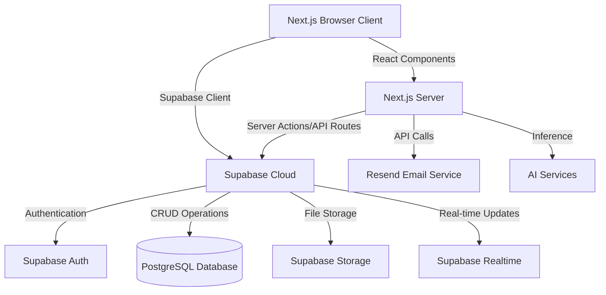

# Architectural Documentation - CareO

## 1. High-Level Overview
CareO is built as a modern web application following a **Serverless-as-a-Service** model. It leverages high-performance frontend frameworks and a real-time reactive backend.

## 2. Technology Stack

### Frontend
- **Framework**: [Next.js 15+](https://nextjs.org/) (App Router)
- **Styling**: Vanilla CSS / Tailwind CSS
- **State Management**: React Hooks + Supabase Realtime subscriptions
- **UI Components**: Radix UI / Shadcn (implied by shadcn filenames)

### Backend (BaaS)
- **Platform**: [Supabase](https://supabase.com/)
- **Database**: PostgreSQL (relational) with ACID transactions and Row Level Security (RLS)
- **Server Logic**: Next.js API Routes + Supabase Postgres functions
- **Authentication**: Supabase Auth (built-in, no third-party auth frameworks)

### External Services
- **Emails**: Resend
- **Analytics**: Posthog
- **AI Integration**: AI SDK (OpenAI/Google Gemini)

## 3. System Architecture Diagram

## 4. Key Architectural Patterns

### 4.1 Reactive Data Flow
CareO uses **Supabase Realtime** subscriptions. When data changes in the database (e.g., a medication is marked as given), the UI updates automatically across all logged-in staff devices without a page refresh. This is achieved through PostgreSQL's replication system and Supabase's real-time engine.

### 4.2 Multi-Tenancy
Data is strictly partitioned using `organization_id`. Every database table includes an `organization_id` field, and **Row Level Security (RLS)** policies enforce isolation at the database level, ensuring users only see data belonging to their care home. This provides defense-in-depth security.

### 4.3 Secure Auth State
Supabase Auth handles session management natively. User sessions are managed through JWT tokens, and RLS policies automatically filter data based on the authenticated user's context. User roles are stored in `auth.users.app_metadata.role`, and organization/team context is stored in the `public.users` table.

### 4.4 Schema Versioning
The system uses database migrations in `supabase/migrations/` to handle schema evolution. Each migration is timestamped and can be rolled back if needed. Schema changes are version-controlled and applied incrementally.

## 5. Security & RBAC
Roles are defined hierarchically:
- **SaaS Admin**: Global platform management.
- **Organization Admin**: Care home level management.
- **Staff (Carer/Nurse)**: Operational access.
- **Unit Access**: Restricting staff to specific wings (units) within a care home.
