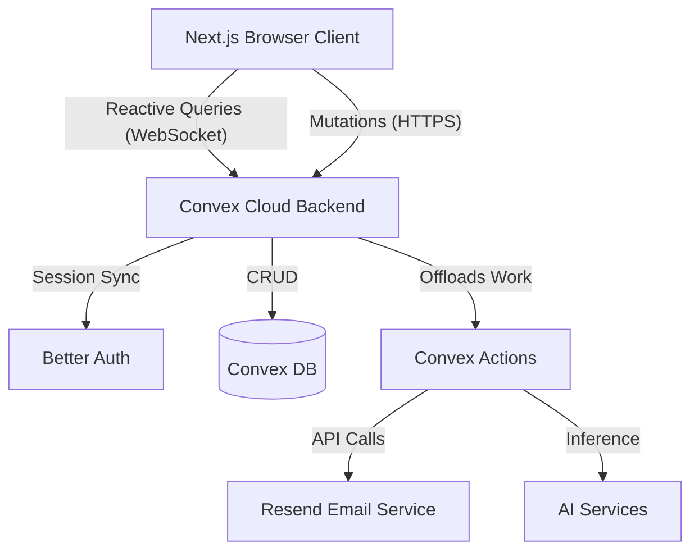

# Architectural Documentation - CareO

## 1. High-Level Overview
CareO is built as a modern web application following a **Serverless-as-a-Service** model. It leverages high-performance frontend frameworks and a real-time reactive backend.

## 2. Technology Stack

### Frontend
- **Framework**: [Next.js 15+](https://nextjs.org/) (App Router)
- **Styling**: Vanilla CSS / Tailwind CSS
- **State Management**: React Hooks + Convex Reactive Queries
- **UI Components**: Radix UI / Shadcn (implied by shadcn filenames)

### Backend (BaaS)
- **Platform**: [Convex](https://www.convex.dev/)
- **Database**: Document-oriented (NoSQL) with ACID transactions.
- **Server Logic**: Convex Mutations, Queries, and Actions (Node.js environment).
- **Authentication**: [Better Auth](https://www.better-auth.com/) integrated with Convex.

### External Services
- **Emails**: Resend
- **Analytics**: Posthog
- **AI Integration**: AI SDK (OpenAI/Google Gemini)

## 3. System Architecture Diagram

## 4. Key Architectural Patterns

### 4.1 Reactive Data Flow
Unlike traditional REST APIs, CareO uses **Convex Subscriptions**. When data changes in the database (e.g., a medication is marked as given), the UI updates automatically across all logged-in staff devices without a page refresh.

### 4.2 Multi-Tenancy
Data is strictly partitioned using `organizationId`. Every database schema includes an `organizationId` field, and the Convex backend enforces isolation through middle-ware/logic checks to ensure users only see data belonging to their care home.

### 4.3 Secure Auth State
Better Auth handles the complexity of session management, while Convex provides the backend execution environment. Sessions are synchronized to allow Convex functions to verify the user's role and organization mid-transaction.

### 4.4 Schema Versioning
As seen in `foodFluidLogs.ts`, the system uses `schemaVersion` fields to handle data migrations and ensure forward compatibility as the application evolves.

## 5. Security & RBAC
Roles are defined hierarchically:
- **SaaS Admin**: Global platform management.
- **Organization Admin**: Care home level management.
- **Staff (Carer/Nurse)**: Operational access.
- **Unit Access**: Restricting staff to specific wings (units) within a care home.
