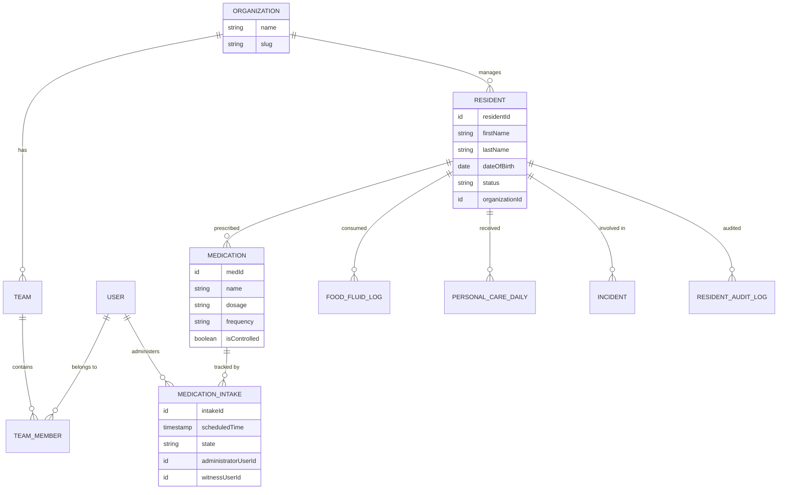
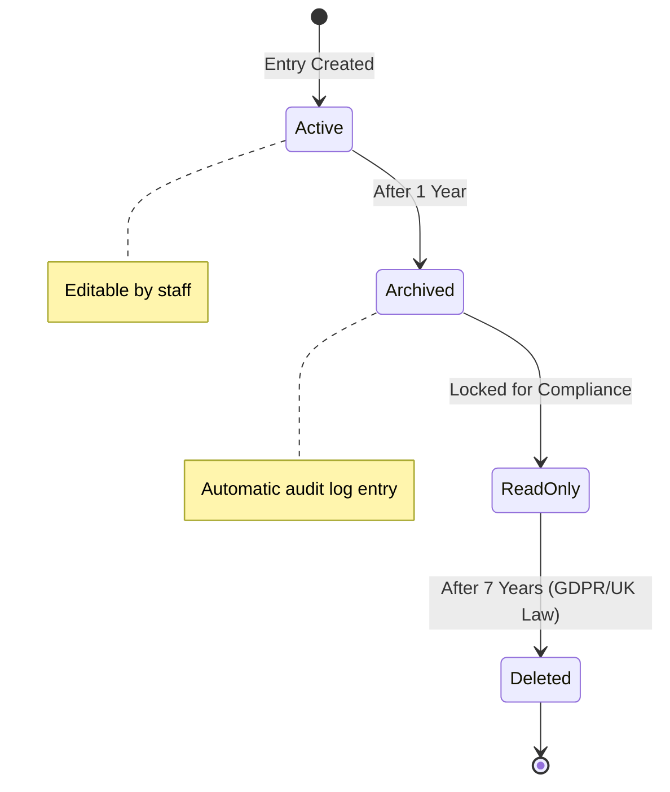

# Data Design & ERD - CareO

## 1. Entity Relationship Diagram (ERD)
The following Mermaid diagram visualizes the relationships between the core data entities in the Convex database.

## 2. Data Retention & Archival State Machine
Visualizing the UK healthcare compliance policy for Food & Fluid logs.

## 3. Storage Strategy
- **Relational Data**: Stored in Convex document tables with strong indexing on `organizationId` and `residentId`.
- **Files/Images**: Stored in Convex File Storage (`_storage`).
- **Audit Logs**: Append-only tables with high performance indexing for date-range queries.
