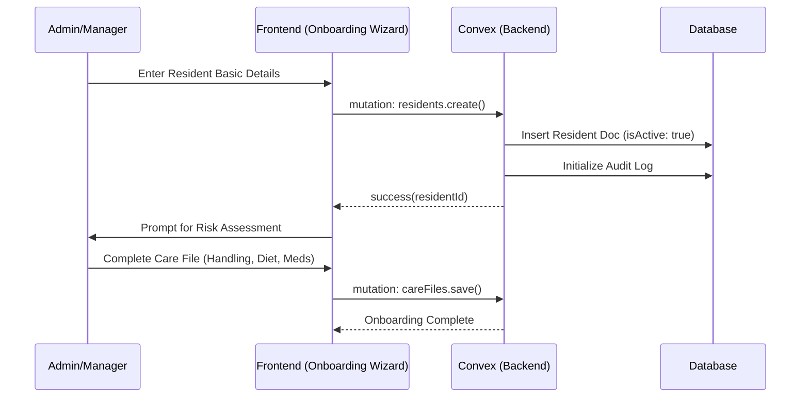
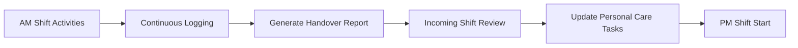

# Flow Diagrams - CareO

## 1. Resident Onboarding Flow
This lifecycle diagram shows how a resident is admitted into the system.



## 2. Medication Administration workflow
The critical path for administering medication, including controlled drug witnessing.

```mermaid
flowchart TD
    Start([Carer opens Med Round]) --> SelectResident[Select Resident]
    SelectResident --> ListMeds[List Scheduled Meds]
    ListMeds --> SelectMed[Select Medication]
    SelectMed --> Administer[Administer Dose]
    Administer --> Sign[Digital Signature (Current User)]
    Sign --> UpdateDB[Update Intake Status]
    UpdateDB --> CheckRefuse{Refused?}
    CheckRefuse -- Yes --> LogReason[Log Refusal Reason]
    CheckRefuse -- No --> Inventory[Decrement Stock]
    Inventory --> End([Round Complete])
```

## 3. Shift Handover Process
How information transitions between shifts.


