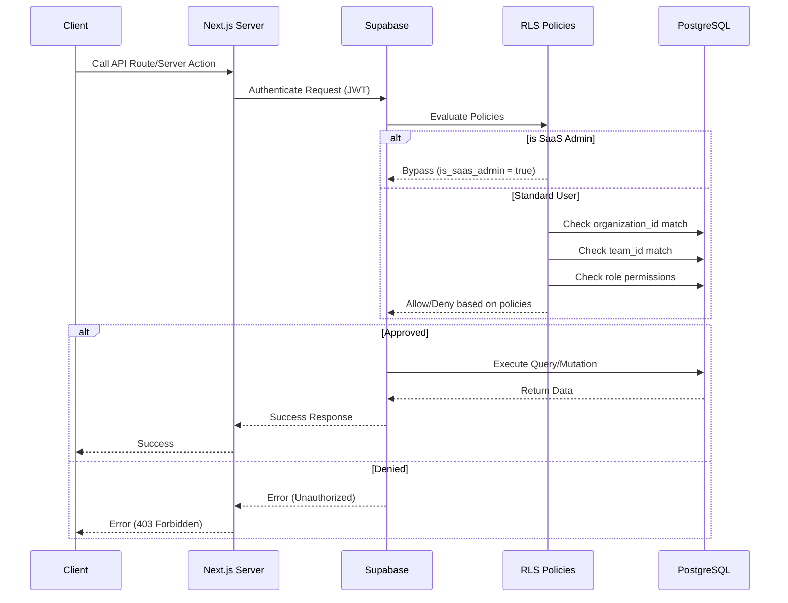
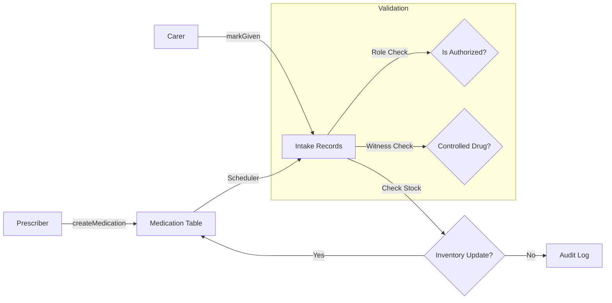
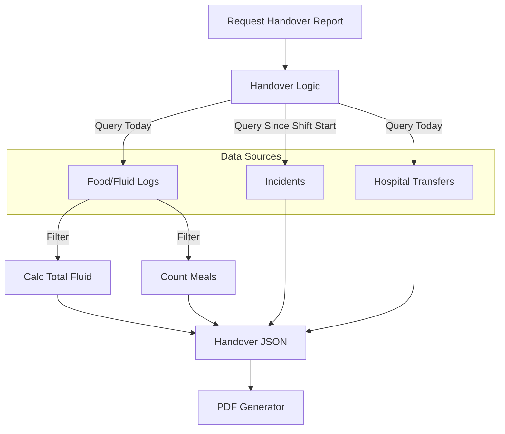

# Low-Level Design (LLD) - CareO

**Version:** 1.1
**Last Updated:** 2026-01-17
**Status:** Approved

---

## 1. Introduction
This Low-Level Design (LLD) document provides the detailed technical specifications for the CareO Care Management Platform. It serves as the blueprint for development, detailing the logic, data flow, component architecture, and security models that underpin the application.

## 2. System Architecture
CareO follows a **Serverless-as-a-Service** architecture, leveraging **Supabase** for the backend, database, and real-time subscription layer, and **Next.js (App Router)** for the frontend application.

### 2.1 Technology Stack
- **Frontend**: Next.js 15+ (React Server Components), Tailwind CSS, Shadcn/UI.
- **Backend / Database**: Supabase (PostgreSQL with Row Level Security).
- **Authentication**: Supabase Auth (native, no third-party frameworks).
- **Analytics**: Posthog.
- **Email**: Resend.

### 2.2 High-Level Architecture
```mermaid
graph TD
    User[User (Browser)] -->|Next.js App Router| Frontend[Frontend (Vercel)]
    Frontend -->|Supabase Client| Supabase[Supabase Cloud]
    
    subgraph Supabase Cloud
        API[PostgreSQL Database]
        RLS[Row Level Security]
        Auth[Supabase Auth]
        Realtime[Realtime Engine]
        Storage[File Storage]
    end
    
    Supabase --> API
    API --> RLS
    API --> Auth
    API --> Realtime
    Supabase --> Storage
    
    Frontend -->|Server Actions| NextJS[Next.js Server]
    NextJS -->|API Calls| Resend[Resend API]
    NextJS -->|Logs Events| Posthog[Posthog Analytics]
```

---

## 3. Frontend Architecture

### 3.1 Directory Structure (`/app`)
The application uses the Next.js App Router with a route group strategy to separate authentication layouts from the main dashboard.

```text
/app
├── (auth)/                 # Public routes with Auth Layout
│   ├── sign-in/            # Login Page
│   └── sign-up/            # Registration Flow
├── (dashboard)/            # Protected routes with Dashboard Layout
│   ├── dashboard/
│   │   ├── residents/      # Resident Management Module
│   │   │   ├── [id]/       # Individual Resident View (Tabs for Meds, Care, etc.)
│   │   └── reports/        # Analytics & Reporting
│   └── layout.tsx          # Dashboard Shell (Sidebar, Header, AuthCheck)
└── api/                    # Next.js Route Handlers (Webhooks, etc.)
```

### 3.2 State Management
- **Server State**: Managed by Supabase client queries with `useEffect` hooks and Supabase Realtime subscriptions. This provides real-time consistency. React Query or SWR can be used for additional caching if needed.
- **Local State**: `useState` / `useReducer` for form inputs and UI toggles.
- **Global UI State**: React Context is used for strictly UI-related global concerns:
    - `ThemeProvider`: Dark/Light mode.
    - `SidebarProvider`: Collapsible sidebar state.
    - `ToastProvider`: Notification toasts (`sonner`).
    - `SupabaseProvider`: Supabase client and session management.

### 3.3 Component Hierarchy
The application prioritizes **Composition** over Inheritance.
- **Page Components**: (`page.tsx`) Responsible for data fetching boundaries and layout structure.
- **Feature Components**: (`components/residents/ResidentCard.tsx`) Domain-specific logic.
- **UI Primitives**: (`components/ui/*`) specific dumb components (Buttons, Inputs) from Shadcn.

---

## 4. Authentication & Security Design

### 4.1 Supabase Auth Integration
Authentication is handled natively by Supabase Auth.
- **Session Management**: Sessions are managed by Supabase Auth using JWT tokens stored in HTTP-only cookies.
- **User Identity**: The `public.users` table extends `auth.users` with domain-specific fields (`is_saas_admin`, `active_team_id`, `is_onboarding_complete`, `active_organization_id`, `active_care_home_id`).
- **Role Storage**: User roles are stored in `auth.users.app_metadata.role` for quick access during RLS policy evaluation.

### 4.2 Role-Based Access Control (RBAC)
The system implements a hierarchical, multi-tenant permission model enforced through Row Level Security (RLS) policies.

**Hierarchy:**
1.  **SaaS Admin**: Complete control (God Mode). Confirmed by `users.is_saas_admin` flag.
2.  **Owner**: Owns an Organization. Can manage all Care Homes and Managers within it.
3.  **Manager**: Assigned to specific `care_homes`. Can manage Teams and Staff.
4.  **Nurse**: Assigned to `Team` (Unit). Can access clinical data for residents in their team.
5.  **Care Assistant**: Assigned to `Team` (Unit). Restricted access (cannot report incidents).

**Resolution Logic**:
Permissions are **never** trusted from the client. RLS policies automatically filter data based on:
1.  User's `active_organization_id` from `public.users` table
2.  User's `active_team_id` for team-scoped data
3.  User's role from `auth.users.app_metadata.role`
4.  Membership in `team_staff` table for team assignments
5.  Membership in `care_home_managers` table for manager roles

### 4.3 Permission Resolution Flow


**Team Switching**:
- Server Action: `updateActiveTeam(teamId)`
- Logic: Verifies team belongs to user's organization -> Updates `users.active_team_id` -> Adds user to `team_staff` if not present -> Returns success.

---

## 5. Backend Module Design

### 5.1 Resident Management
- **Core Table**: `residents`
- **Logic**: Server actions and API routes in `app/api/` or hooks in `hooks/`
    - **Creation**: Requires `Manager` role or higher. RLS policies enforce this. Initialized as active.
    - **Retrieval**: RLS policies automatically scope by `organization_id` or `team_id` depending on user's role and active context (Nurses see Team only, Managers see Care Home).
    - **Files**: Images are stored in Supabase Storage and linked via `image_url` column.

### 5.2 Medication Administration Record (MAR)
- **Core Tables**: `medication`, `medicationIntake`
- **Scheduling Logic**:
    - When `createMedication` is called, `createMedicationIntakes` helper generates future `medicationIntake` records based on frequency (e.g., "BD" = 2x/day) and start/end dates.
    - **PRN (As Needed)**: No future intakes generated. Created on demand.
- **Administration Logic**:
    - Mutation `markGiven`: Updates `medicationIntake` status to `taken`.
    - **Inventory**: Decrements `medication.quantityInStock`.
    - **Witnessing**: The schema (`witnessByUserId`) supports "Controlled Drug" witnessing. *Note: Strict API enforcement of the second signature is currently a client-side flow, with the backend validating the presence of the witness ID.*

### 5.2.1 Medication Data Flow


### 5.3 Incidents & Reporting
- **Core Table**: `incidents`
- **Design**: A monolithic schema (`incidents.ts`) capturing 20 sections of data (Injury, Witnesses, Treatment).
- **Workflow**:
    1.  **Report**: `create` mutation. Blocked for `Care Assistant` role.
    2.  **Notify**: `getIncidentsWithResidents` query enables a notification feed. It joins with `residents` to show context.
    3.  **Read Tracking**: `notificationReadStatus` table tracks who has viewed which incident.
    4.  **Audit**: Managers verify incidents. Only Managers can `update` (edit) an incident.

### 5.4 Care Files (Dynamic Assessments)
- **Directory**: Tables in Supabase (`pre_admission_assessments`, `skin_integrity_assessments`, etc.)
- **Design**: Each assessment type is a separate table with JSONB `assessment_data` column for flexible schema.
- **Pattern**:
    - Each assessment has server actions/hooks for `create` / `update` / `getLatest` operations.
    - All assessments link back to `resident_id` via foreign key.
    - Commonly used assessments: `SkinIntegrity`, `MovingHandling`, `DietNotification`.

### 5.5 Handover & Shift Management
- **Logic**: Hooks in `hooks/use-handover-report.ts` and server actions
- **Purpose**: Aggregates data for Shift Handovers (7 AM / 7 PM).
- **Aggregation Logic**:
    - **Food/Fluid**: Queries `food_fluid_logs` table for the day. Differentiates "Food" vs "Fluid" based on `type_of_food_drink` (e.g., "Water", "Tea" = Fluid). Sums `fluid_consumed_ml`.
    - **Incidents**: Fetches incidents created `> afterTimestamp` (start of shift) from `incidents` table.
    - **Transfers**: Fetches `hospital_transfers` table.
- **Output**: Returns a JSON summary object used to populate the Handover PDF/View. Stored in `handover_reports` table with JSONB `handover_data` column.

### 5.5.1 Handover Aggregation


---

## 6. Data & Storage Design

### 6.1 Schema Philosophy
- **Multi-Tenancy**: Every table (except system tables) **MUST** have `organization_id` column.
- **Soft Deletes**: Key records (`residents`, `users`) use `is_active` flags or `archived_at` timestamps rather than physical deletion.
- **Types**: PostgreSQL `UUID` is used for all primary keys and foreign keys. Foreign key constraints ensure referential integrity at the database level.
- **RLS Enforcement**: All tables have Row Level Security enabled with policies scoping by `organization_id`, `team_id`, or `care_home_id` as appropriate.

### 6.2 Key Relationships (ERD Summary)
- `Organization` 1 -- * `CareHome`
- `CareHome` 1 -- * `Unit` (Team)
- `Unit` 1 -- * `Resident`
- `Resident` 1 -- * `Medication`
- `Resident` 1 -- * `CareFile` (Polymorphic: Waterlow, BodyMap, etc.)
- `Resident` 1 -- * `Incident`

---

## 7. Integrations

### 7.1 Email (Resend)
- **Usage**: Invites, Password Resets, Critical Incident Alerts.
- **Implementation**: Next.js API routes in `app/api/email/` or server actions triggered by user actions.

### 7.2 Analytics (Posthog)
- **Usage**: Product usage tracking (Page views, Feature usage).
- **Implementation**: Client-side provider `components/providers/PosthogProvider.tsx`.

### 7.3 PDF Generation
- **Usage**: Printing MAR sheets, Handover reports.
- **Implementation**: Client-side generation using `jspdf` and `jspdf-autotable`, populated by Supabase queries. PDFs can be stored in Supabase Storage for archival.
