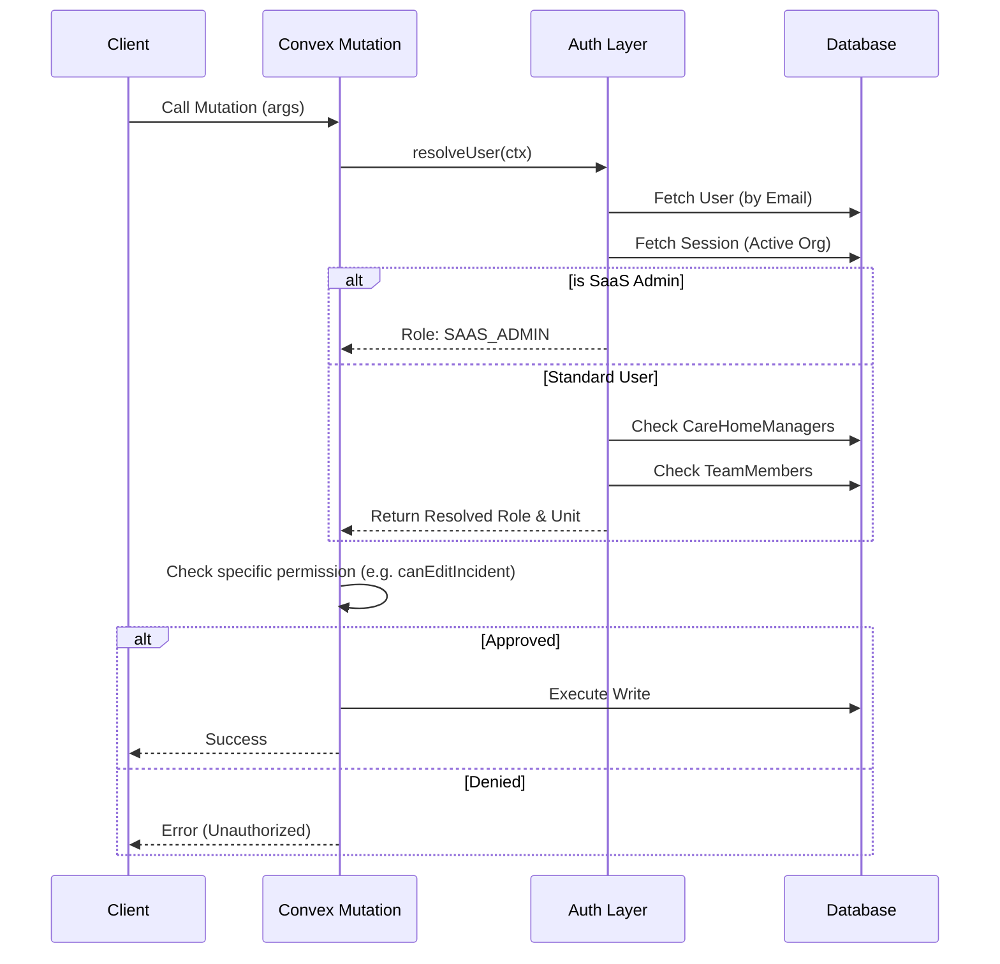
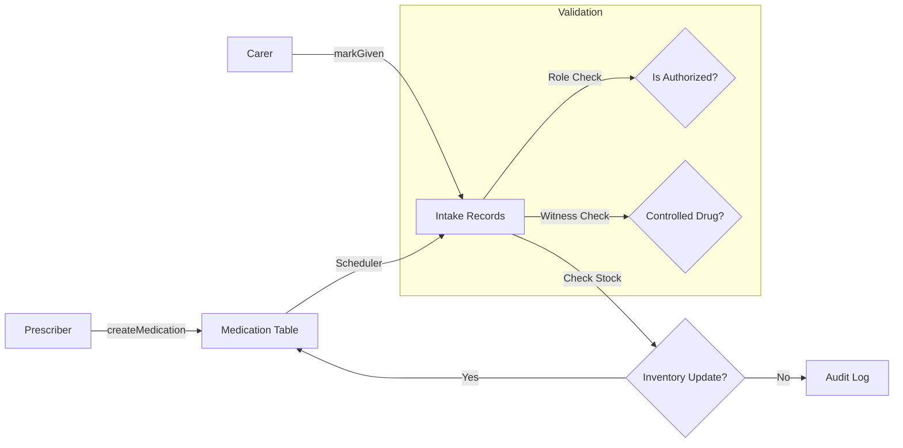
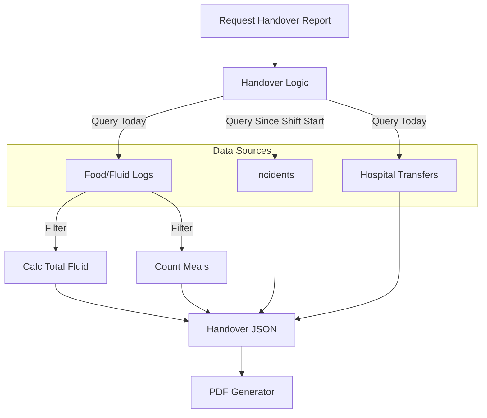

# Low-Level Design (LLD) - CareO

**Version:** 1.1
**Last Updated:** 2026-01-17
**Status:** Approved

---

## 1. Introduction
This Low-Level Design (LLD) document provides the detailed technical specifications for the CareO Care Management Platform. It serves as the blueprint for development, detailing the logic, data flow, component architecture, and security models that underpin the application.

## 2. System Architecture
CareO follows a **Serverless-as-a-Service** architecture, leveraging **Convex** for the backend, database, and real-time subscription layer, and **Next.js (App Router)** for the frontend application.

### 2.1 Technology Stack
- **Frontend**: Next.js 14+ (React Server Components), Tailwind CSS, Shadcn/UI.
- **Backend / Database**: Convex (Reactive Backend as a Service).
- **Authentication**: Better Auth (with Convex Adapter).
- **Analytics**: Posthog.
- **Email**: Resend.

### 2.2 High-Level Architecture
```mermaid
graph TD
    User[User (Browser)] -->|Next.js App Router| Frontend[Frontend (Vercel)]
    Frontend -->|Convex Client| Convex[Convex Backend]
    
    subgraph Convex Cloud
        API[API Layer (Queries/Mutations)]
        DB[(Database)]
        Auth[Auth Adapter]
        Cron[Cron Jobs]
    end
    
    Convex --> API
    API --> DB
    API --> Auth
    Cron --> API
    
    Auth -->|Validates| BetterAuth[Better Auth]
    API -->|Logs Events| Posthog[Posthog Analytics]
    API -->|Sends Email| Resend[Resend API]
```

---

## 3. Frontend Architecture

### 3.1 Directory Structure (`/app`)
The application uses the Next.js App Router with a route group strategy to separate authentication layouts from the main dashboard.

```text
/app
├── (auth)/                 # Public routes with Auth Layout
│   ├── sign-in/            # Login Page
│   └── sign-up/            # Registration Flow
├── (dashboard)/            # Protected routes with Dashboard Layout
│   ├── dashboard/
│   │   ├── residents/      # Resident Management Module
│   │   │   ├── [id]/       # Individual Resident View (Tabs for Meds, Care, etc.)
│   │   └── reports/        # Analytics & Reporting
│   └── layout.tsx          # Dashboard Shell (Sidebar, Header, AuthCheck)
└── api/                    # Next.js Route Handlers (Webhooks, etc.)
```

### 3.2 State Management
- **Server State**: Managed entirely by `convex/react` hooks (`useQuery`, `useMutation`). This provides real-time consistency. React Query is **not** needed as Convex handles caching and subscription.
- **Local State**: `useState` / `useReducer` for form inputs and UI toggles.
- **Global UI State**: React Context is used for strictly UI-related global concerns:
    - `ThemeProvider`: Dark/Light mode.
    - `SidebarProvider`: Collapsible sidebar state.
    - `ToastProvider`: Notification toasts (`sonner`).

### 3.3 Component Hierarchy
The application prioritizes **Composition** over Inheritance.
- **Page Components**: (`page.tsx`) Responsible for data fetching boundaries and layout structure.
- **Feature Components**: (`components/residents/ResidentCard.tsx`) Domain-specific logic.
- **UI Primitives**: (`components/ui/*`) specific dumb components (Buttons, Inputs) from Shadcn.

---

## 4. Authentication & Security Design

### 4.1 Better Auth Integration (`convex/auth.ts`)
Authentication is handled by `Better Auth` with a custom Convex adapter.
- **Session Management**: Sessions are stored in the `sessions` table.
- **User Identity**: The `users` table in Convex mirrors the Better Auth user but adds domain-specific fields (`isSaasAdmin`, `activeTeamId`, `isOnboardingComplete`).

### 4.2 Role-Based Access Control (RBAC) (`convex/lib/rbac.ts`)
The system implements a hierarchical, multi-tenant permission model.

**Hierarchy:**
1.  **SaaS Admin**: Complete control (God Mode). Confirmed by `users.isSaasAdmin` flag.
2.  **Owner**: Owns an Organization. Can manage all Care Homes and Managers within it.
3.  **Manager**: Assigned to specific `CareHomes`. Can manage Units and Staff.
4.  **Nurse**: Assigned to `Team` (Unit). Can access clinical data for residents in their unit.
5.  **Care Assistant**: Assigned to `Team` (Unit). Restricted access (cannot report incidents).

**Resolution Logic (`resolveUser`)**:
Permissions are **never** trusted from the client. Every mutation/query resolves the user context:
1.  Fetch `user` from `ctx.auth`.
2.  Resolve `organizationId` from active session.
3.  Calculate `activeUnitId` based on `user.activeTeamId`.
4.  Determine `role` dynamically (checking `isSaasAdmin`, then `CareHomeManagers` table, then `TeamMembers` table).

### 4.3 Permission Resolution Flow


**Team Switching**:
- Mutation: `updateActiveTeam(teamId)`
- Logic: Verifies team belongs to user's organization -> Updates `users.activeTeamId` -> Adds user to `teamMembers` if not present -> Returns success.

---

## 5. Backend Module Design (`convex/`)

### 5.1 Resident Management
- **Core Table**: `residents`
- **Logic**: (`residents.ts`)
    - **Creation**: Requires `Manager` role or higher. Initialized as active (`isActive: true`).
    - **Retrieval**: `getResidents` query uses `scopeByOrganization` or `scopeByUnit` depending on legal requirements (Nurses see Unit only, Managers see Home).
    - **Files**: Images are stored in `files` table and linked via `storageId`.

### 5.2 Medication Administration Record (MAR)
- **Core Tables**: `medication`, `medicationIntake`
- **Scheduling Logic**:
    - When `createMedication` is called, `createMedicationIntakes` helper generates future `medicationIntake` records based on frequency (e.g., "BD" = 2x/day) and start/end dates.
    - **PRN (As Needed)**: No future intakes generated. Created on demand.
- **Administration Logic**:
    - Mutation `markGiven`: Updates `medicationIntake` status to `taken`.
    - **Inventory**: Decrements `medication.quantityInStock`.
    - **Witnessing**: The schema (`witnessByUserId`) supports "Controlled Drug" witnessing. *Note: Strict API enforcement of the second signature is currently a client-side flow, with the backend validating the presence of the witness ID.*

### 5.2.1 Medication Data Flow


### 5.3 Incidents & Reporting
- **Core Table**: `incidents`
- **Design**: A monolithic schema (`incidents.ts`) capturing 20 sections of data (Injury, Witnesses, Treatment).
- **Workflow**:
    1.  **Report**: `create` mutation. Blocked for `Care Assistant` role.
    2.  **Notify**: `getIncidentsWithResidents` query enables a notification feed. It joins with `residents` to show context.
    3.  **Read Tracking**: `notificationReadStatus` table tracks who has viewed which incident.
    4.  **Audit**: Managers verify incidents. Only Managers can `update` (edit) an incident.

### 5.4 Care Files (Dynamic Assessments)
- **Directory**: `convex/careFiles/`
- **Design**: Each assessment type is a separate module (e.g., `waterlow.ts`, `bedRails.ts`).
- **Pattern**:
    - Each module exports a `create` / `update` / `getLatest` function.
    - All assessments link back to `residentId`.
    - Commonly used assessments: `SkinIntegrity`, `MovingHandling`, `DietNotification`.

### 5.5 Handover & Shift Management
- **Logic**: (`handover.ts`)
- **Purpose**: Aggregates data for Shift Handovers (7 AM / 7 PM).
- **Aggregation Logic**:
    - **Food/Fluid**: Queries `foodFluidLogs` for the day. Differentiates "Food" vs "Fluid" based on `typeOfFoodDrink` (e.g., "Water", "Tea" = Fluid). Sums `fluidConsumedMl`.
    - **Incidents**: Fetches incidents created `> afterTimestamp` (start of shift).
    - **Transfers**: Fetches `hospitalTransferLogs`.
- **Output**: Returns a JSON summary object used to populate the Handover PDF/View.

### 5.5.1 Handover Aggregation


---

## 6. Data & Storage Design

### 6.1 Schema Philosophy
- **Multi-Tenancy**: Every table (except system tables) **MUST** have `organizationId`.
- **Soft Deletes**: Key records (`residents`, `users`) use `isActive` flags or `archivedAt` timestamps rather than physical deletion.
- **Types**: Convex `v.id()` is used for all foreign keys to ensure referential integrity at the application level.

### 6.2 Key Relationships (ERD Summary)
- `Organization` 1 -- * `CareHome`
- `CareHome` 1 -- * `Unit` (Team)
- `Unit` 1 -- * `Resident`
- `Resident` 1 -- * `Medication`
- `Resident` 1 -- * `CareFile` (Polymorphic: Waterlow, BodyMap, etc.)
- `Resident` 1 -- * `Incident`

---

## 7. Integrations

### 7.1 Email (Resend)
- **Usage**: Invites, Password Resets, Critical Incident Alerts.
- **Implementation**: `convex/actions/email.ts` (hypothetical path based on standard pattern) triggered by mutations via internal actions.

### 7.2 Analytics (Posthog)
- **Usage**: Product usage tracking (Page views, Feature usage).
- **Implementation**: Client-side provider `components/providers/PosthogProvider.tsx`.

### 7.3 PDF Generation
- **Usage**: Printing MAR sheets, Handover reports.
- **Implementation**: Likely client-side generation using `react-pdf` or similar, populated by the aggregated data queries (e.g., `handover.getHandoverReport`).
